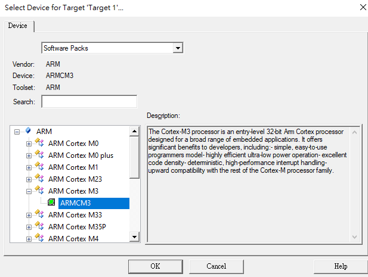
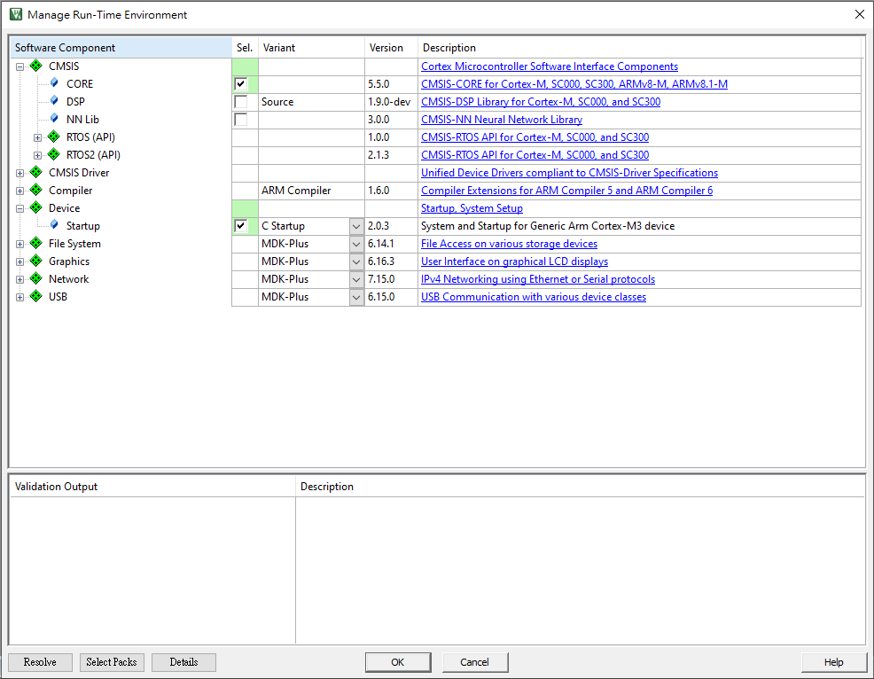
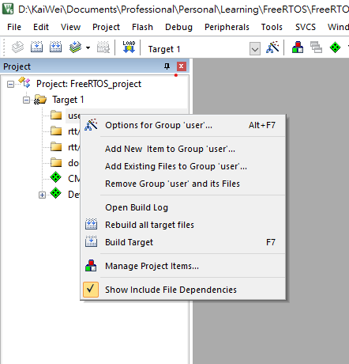
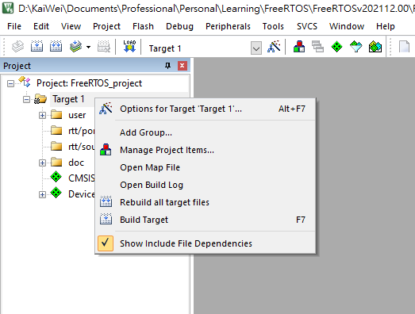
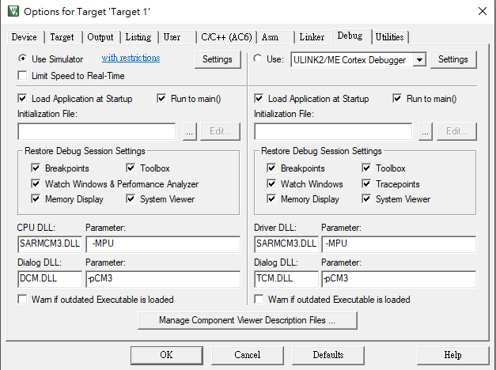
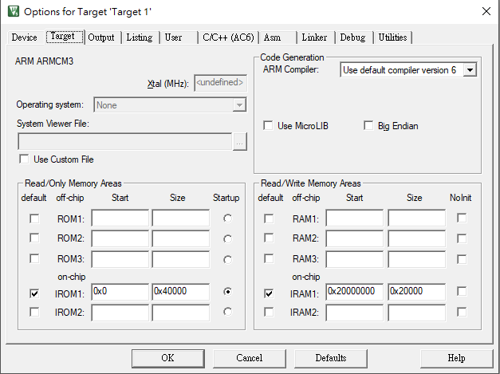
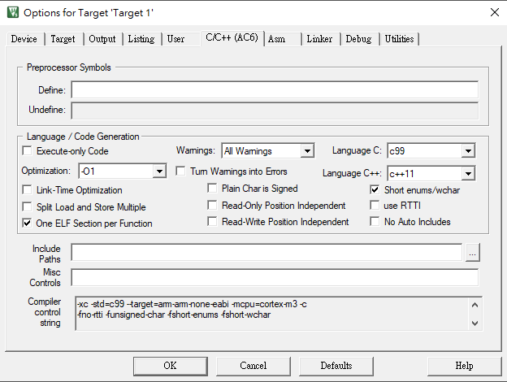

<!-- Copyright 2022 KaiWei TSOU. All Rights Reserved.
    This personal note refers to <<FreeRTOS 內核實現與應用開發實戰指南>> by "野火".
-->


# 4.1 FreeRTOS Source Code

FreeRTOS 的 source code 可以從 [github](https://github.com/FreeRTOS) clone 下來，也可以從 FreeRTOS 的[官網](https://www.freertos.org/a00104.html) 下載。接下來我們需要安裝 ARM KEIL 的編譯器，請見[官網](https://www2.keil.com/mdk5)。

# 4.2 使用 KEIL 新建 Project

KEIL5 版本 5.36。建議讀者使用 5.23，與書中版本一致，避免遇到如 [4.5.2 修改時鐘大小](#4.5.2-修改時鐘大小)此節的問題

## 4.2.1 New Project

安裝好 ARM KEIL 後，我們開始創建 project，先在 ```FreeRTOSv202112.00/FreeRTOS``` 創建擺放 project 檔的資料夾 ```project```，再開啟 KEIL $\mu$Vision5，並點選 project $\rightarrow$ New $\mu$Vision Project...，將創建的 project 檔放在剛剛創設的資料夾內。

## 4.2.2 Select Device for Target

接下來需要選擇目標裝置，此處可以選取 ARMCM3：

<p align=center></p>


## 4.2.3 Manage Run-Time Environment

接下來會跳出 run-time 環境的選項，這裡選取 CMSIS 選項中的 CORE，以及 Device 選項中的 Startup 這兩個文件。

<p align=center></p>

# 4.3 在 KEIL Project 新建資料夾

接下來我們可以對左方檔案欄中的 ```Target 1``` 按右鍵，並且選取 "Manage Project Items..."，新增以下新資料夾：```user```、```rtt/ports```、```rtt/source```、```doc```。直接在空白處連續點擊兩次左鍵，就會自動新增一個 group，並且供使用者命名。

# 4.4 在 KEIL Project 新建文件

接下來我們將 ```main.c``` 檔案建立於 ```user``` 資料夾中，並且在 ```doc``` 資料夾裡新增 ```README.txt```。具體方法是在 ```user``` 資料夾按右鍵，並且選取 "Add New Item to Group "user"..."，即可選擇欲建立的檔案類型。

<p align=center></p>

## 4.4.1 編寫 main 函式

復位程式會呼叫 C 函式庫裡的 ```__main```，其作用在於初始化系統變量，例如 global 變量，在 ```__main``` 最後會呼叫 ```__rtentry``` 函式，由此函式呼叫 main function，進入 C 的領域。

```c
// main.c

int main () {
    while (1) {
        // do nothing
    }
	
    return 0;
}
```

# 4.5 設定

## 4.5.1 軟體模擬設定

最後，我們在 ```Target 1``` 資料鍵按右鍵，並且點取 "Options for Target 'Target1'..."，在 "Debug" 選項中，勾選 "using simulation"。

<p align=center>
    
    
</p>

## 4.5.2 修改時鐘大小

模擬環境中的時鐘大小必須與 ```system_ARMCM3.c``` 裡面所定義的時鐘大小一致，確保時間的準確性。以下為 ```system_ARMCM3.c``` 定義的系統時間頻率 25 MHz，因此我們必須將軟體模擬的時間也調整為 25 MHz。

```c
#define  XTAL            (50000000UL)     /* Oscillator frequency */
#define  SYSTEM_CLOCK    (XTAL / 2U)
```

設定時鐘頻率的地方如下。但是我發現 KEIL5 5.36 版本在該 Xtal 選項為 undefined，似乎無法設定，目前這個設定先跳過。

<p align=center>
    
</p>


## 4.5.3 添加文件路徑

最後我們需要添加文件路徑，以免編譯失敗。需要添加的有 ```user```、```FreeRTOS/Source/include```、```FreeRTOS/Source/portable/RVDS/ARM_CM3```。至此應該能編譯成功。

<p align=center>
    
</p>


