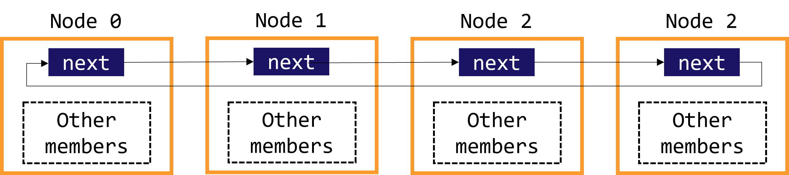
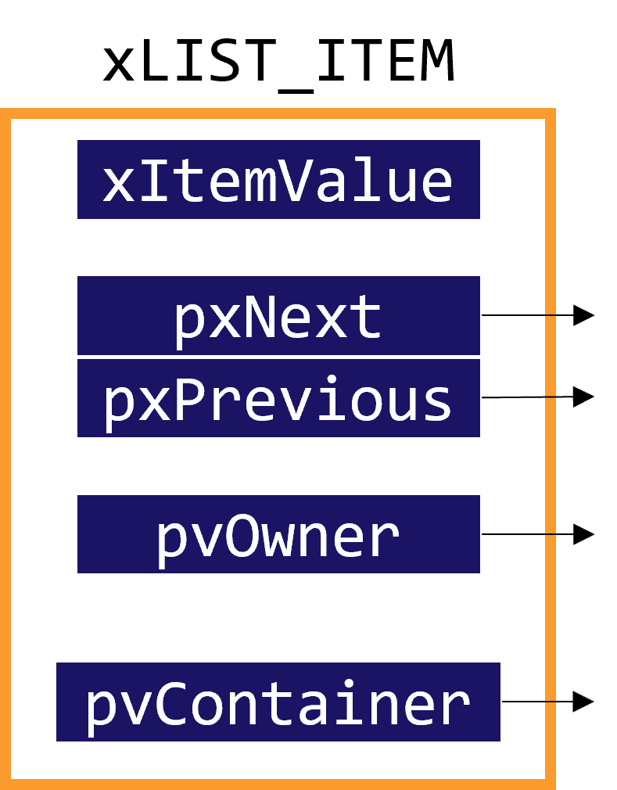
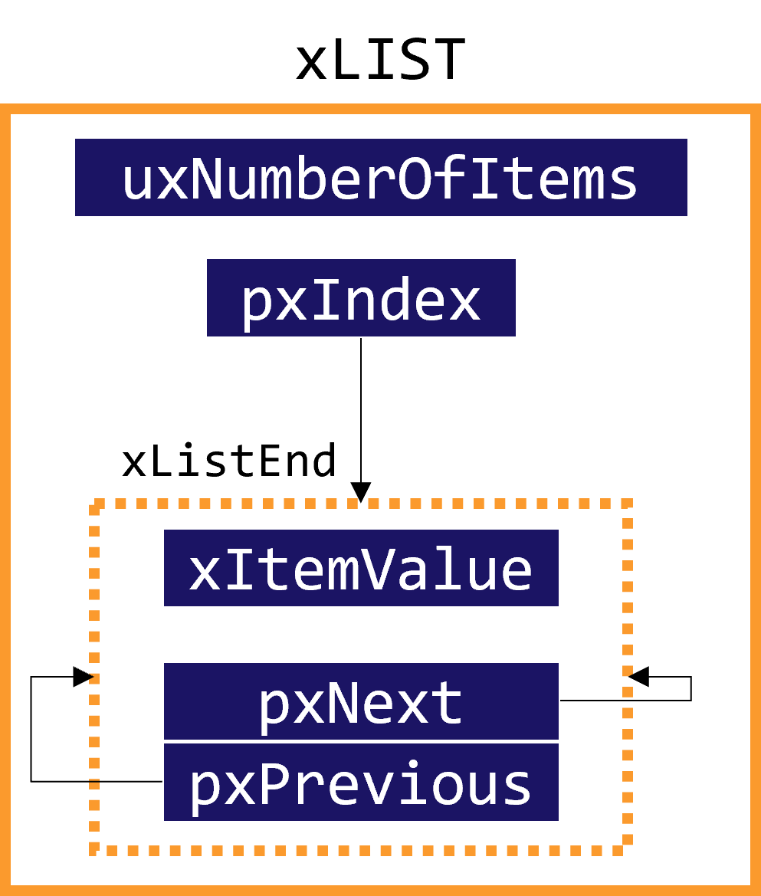
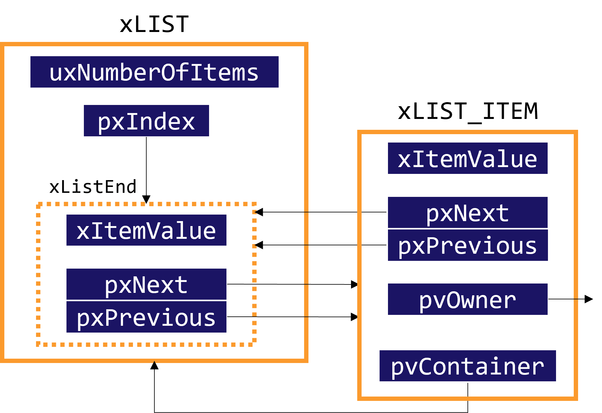
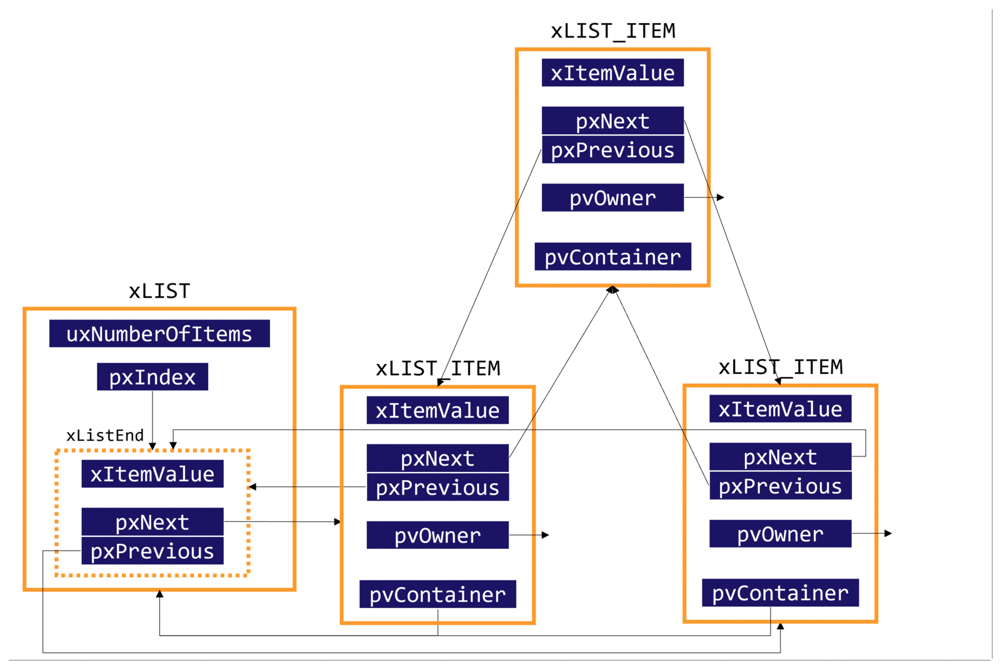
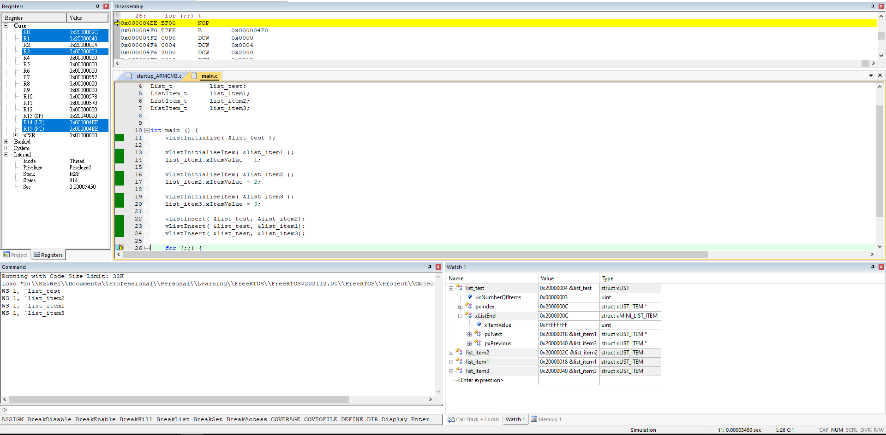

<!-- Copyright 2022 KaiWei TSOU. All Rights Reserved.
    This personal note refers to <<FreeRTOS 內核實現與應用開發實戰指南>> by "野火".
-->


# 6.1 Introduction to Linked List

## 6.1.1 Singly Linked List

```c
typedef struct node node;
struct node {
    node *next;
    // other members
};
```

最常看到的 linked list 資料結構如上。但是這種資料結構會比較少使用，通常的做法是節點裡面只包含一個用於指向下一個節點的指針，其他數據並不會包含在這個指針型別中，程式碼以及架構如下。

```c
typedef struct node node;
struct node {
    node *next;
}

typedef user_struct_t user_struct_t;
struct user_struct_t {
    node *next;
    // other members
}

```

<p align=center>
    
</p>


## 6.1.2 Doubly Linked List

除了指向下一個節點之外，也有指向前一個節點的資料。

```c
typedef struct node node;
struct node {
    node *next;
    node *previous;
}

typedef user_struct_t user_struct_t;
struct user_struct_t {
    node *next;
    node *previous;
    // other members
}
```

## 6.1.3 Difference between Linked List and Array

Linked list 是通過節點將資料連結成一條鏈，通過對節點的插入和刪除，從而實現數據的存取。另一方面，array 是直接配置一個連續的記憶體空間，供使用者存取資料。

# 6.2 Linked List in FreeRTOS

## 6.2.1 Node of Linked List

### 1. 定義節點的資料結構

Linked list 的資料結構在 ```list.h``` 裡面定義。

<p align=center>
    
</p>

```c
struct xLIST_ITEM
{
    listFIRST_LIST_ITEM_INTEGRITY_CHECK_VALUE
    configLIST_VOLATILE TickType_t xItemValue;
    struct xLIST_ITEM * configLIST_VOLATILE pxNext;
    struct xLIST_ITEM * configLIST_VOLATILE pxPrevious;
    void * pvOwner;
    struct xLIST * configLIST_VOLATILE pxContainer;
    listSECOND_LIST_ITEM_INTEGRITY_CHECK_VALUE
};
typedef struct xLIST_ITEM ListItem_t;     
```

其中 ```TickType_t``` 在 ```portmacro.h``` 文件中定義。若 ```configUSE_16_BIT_TICKS``` 是 ```1``` 的話，```TickType_t``` 將是 ```uint16_t```，反之將為 ```uint32_t```。```configUSE_16_BIT_TICKS``` 在 ```FreeRTOSConfig.h``` 文件中定義，默認為 ```0```。

```c
#if( configUSE_16_BIT_TICKS == 1 )
	typedef uint16_t TickType_t;
	#define portMAX_DELAY ( TickType_t ) 0xffff
#else
	typedef uint32_t TickType_t;
	#define portMAX_DELAY ( TickType_t ) 0xffffffffUL
#endif
```

總結 ```ListItem_t``` 中各個變數的功能：

變數                                            | 功用
:-----------------------------------------------|:--------------------------------------------------
```configLIST_VOLATILE TickType_t xItemValue``` | 輔助值，幫助節點做順序排列
```struct xLIST_ITEM * configLIST_VOLATILE pxNext``` | 指向下一個節點
```struct xLIST_ITEM * configLIST_VOLATILE pxPrevious``` | 指向上一個節點
```void * pvOwner``` | 註明該 linked list 屬於(鑲嵌於)何種資料結構中
```struct xLIST * configLIST_VOLATILE pxContainer``` | 用於指向該節點所在的 linked list，通常指向根節點


**Note:** 在 C 語言中，未定義的 macro 將被默認為 ```0```。

**Note:** ```#define``` 和 ```typedef``` 的差異，主要有幾點：

- ```#define``` 在 preprocessor 就已經處理，並不會在 compilation 的時候做。而 ```typedef``` 的編譯則是由 compiler 執行。
- ```#define``` 單純做 copy-paste 的動作，因此當我們遇到以下程式碼，只有 ```a``` 會被宣告為 ```char *```，其他變數將是 ```char```。

```c
#define PTR char*
PTR a, b, c;
```

- ```typedef``` 會受到 scope 引響，而 ```#define``` 沒有 scope 的問題。


### 2. 節點的初始化

```c
void vListInitialiseItem( ListItem_t * const pxItem )
{
    /* Make sure the list item is not recorded as being on a list. */
    pxItem->pxContainer = NULL;

    /* Write known values into the list item if
     * configUSE_LIST_DATA_INTEGRITY_CHECK_BYTES is set to 1.
     */
    listSET_FIRST_LIST_ITEM_INTEGRITY_CHECK_VALUE( pxItem );
    listSET_SECOND_LIST_ITEM_INTEGRITY_CHECK_VALUE( pxItem );
}
```

節點資料結構的初始化在 ```list.c``` 實現。```ListItem_t``` 有 5 個成員，初始化的時候只要將 ```pxContainer``` 設為空指標即可。

## 6.2.2 Root Node of Linked List

### 1. 定義 Linked List 根節點的資料結構

Linked list 的根節點 ```xList``` 和一般節點的資料結構不太一樣，其資料結構在 ```list.h``` 定義。

<p align=center>
    
</p>

```c
/*
 * Definition of the type of queue used by the scheduler.
 */

#if ( configUSE_LIST_DATA_INTEGRITY_CHECK_BYTES == 0 )
    #define listFIRST_LIST_INTEGRITY_CHECK_VALUE
    #define listSECOND_LIST_INTEGRITY_CHECK_VALUE
#else
    #define listFIRST_LIST_INTEGRITY_CHECK_VALUE          TickType_t xListIntegrityValue1;
    #define listSECOND_LIST_INTEGRITY_CHECK_VALUE         TickType_t xListIntegrityValue2;
#endif

typedef struct xLIST
{
    listFIRST_LIST_INTEGRITY_CHECK_VALUE
    volatile UBaseType_t uxNumberOfItems;
    ListItem_t * configLIST_VOLATILE pxIndex;
    MiniListItem_t xListEnd;
    listSECOND_LIST_INTEGRITY_CHECK_VALUE
} List_t;

struct xMINI_LIST_ITEM
{
    listFIRST_LIST_ITEM_INTEGRITY_CHECK_VALUE
    configLIST_VOLATILE TickType_t xItemValue;
    struct xLIST_ITEM * configLIST_VOLATILE pxNext;
    struct xLIST_ITEM * configLIST_VOLATILE pxPrevious;
};
```


- ```uxNumberOfItems``` 變量用於標記目前 linked list 的節點數。
- ```pxIndex``` 用於遍歷 linked list 的節點。```xListEnd``` 則是代表 linked list 的最後一個節點。
- ```listFIRST_LIST_INTEGRITY_CHECK_VALUE``` 和 ```listSECOND_LIST_INTEGRITY_CHECK_VALUE``` 是為了檢察 linked list 的完整性，若 ```configUSE_LIST_DATA_INTEGRITY_CHECK_BYTES``` 被 defined 為 1，則該兩個變量會被初始為某個數值，若該數值改變代表 linked list 被破壞。

### 2. 根節點初始化

<p align=center>
    
</p>


```c
#if ( configUSE_16_BIT_TICKS == 1 )
    #define pdINTEGRITY_CHECK_VALUE    0x5a5a
#else
    #define pdINTEGRITY_CHECK_VALUE    0x5a5a5a5aUL
#endif

#if ( configUSE_LIST_DATA_INTEGRITY_CHECK_BYTES == 0 )
    #define listSET_LIST_INTEGRITY_CHECK_1_VALUE( pxList )
    #define listSET_LIST_INTEGRITY_CHECK_2_VALUE( pxList )
#else
    #define listSET_LIST_INTEGRITY_CHECK_1_VALUE( pxList ) ( pxList )->xListIntegrityValue1 = pdINTEGRITY_CHECK_VALUE
    #define listSET_LIST_INTEGRITY_CHECK_2_VALUE( pxList ) ( pxList )->xListIntegrityValue2 = pdINTEGRITY_CHECK_VALUE
#endif

void vListInitialise( List_t * const pxList )
{
    pxList->pxIndex = ( ListItem_t * ) &( pxList->xListEnd );
    pxList->xListEnd.xItemValue = portMAX_DELAY;
    pxList->xListEnd.pxNext = ( ListItem_t * ) &( pxList->xListEnd );
    pxList->xListEnd.pxPrevious = ( ListItem_t * ) &( pxList->xListEnd );
    pxList->uxNumberOfItems = ( UBaseType_t ) 0U;

    listSET_LIST_INTEGRITY_CHECK_1_VALUE( pxList );
    listSET_LIST_INTEGRITY_CHECK_2_VALUE( pxList );
}
```

需要注意的是，如果 ```configUSE_LIST_DATA_INTEGRITY_CHECK_BYTES``` 為 ```1```，那根節點的 ```xListIntegrityValue1``` 和 ```xListIntegrityValue2``` 將根據 ```configUSE_16_BIT_TICKS``` 被初始化為 ```0x5a5a``` 或是 ```0x5a5a5a5aUL```。

一開始 ```pxIndex``` 遍歷指針會指向 ```xListEnd```，因為一開始 linked list 不會有任何節點，因此只能指向最後一個節點。而 ```xListEnd``` 內的兩個指針將會指向自身，且 ```pxList->uxNumberOfItems``` 被初始為 ```0```。

最後需要提到的是，linked list 內的節點值是依照順序漸增，因此最後一個節點 ```xListEnd.xItemValue``` 應被設為最大值。


### 3. 將節點插入 Linked List 最尾部

將節點插入 linked list 的尾部，此函式用於將第一個新的節點加入空的 linked list。

<p align=center>
    
</p>

```c
void vListInsertEnd( List_t * const pxList,
                     ListItem_t * const pxNewListItem )
{
    ListItem_t * const pxIndex = pxList->pxIndex;

    pxNewListItem->pxNext = pxIndex;
    pxNewListItem->pxPrevious = pxIndex->pxPrevious;

    pxIndex->pxPrevious->pxNext = pxNewListItem;
    pxIndex->pxPrevious = pxNewListItem;

    pxNewListItem->pxContainer = pxList;

    ( pxList->uxNumberOfItems )++;
}
```

### 4. 將節點按照順序插入 linked list

<p align=center>
    
</p>

```c
void vListInsert( List_t * const pxList,
                  ListItem_t * const pxNewListItem )
{
    ListItem_t * pxIterator;
    const TickType_t xValueOfInsertion = pxNewListItem->xItemValue;

    if( xValueOfInsertion == portMAX_DELAY )
    {
        pxIterator = pxList->xListEnd.pxPrevious;
    }
    else
    {
        for( pxIterator = ( ListItem_t * ) &( pxList->xListEnd ); 
            pxIterator->pxNext->xItemValue <= xValueOfInsertion; 
            pxIterator = pxIterator->pxNext ) 
        {
            /* There is nothing to do here, just iterating to the wanted
             * insertion position. */
        }
    }

    pxNewListItem->pxNext = pxIterator->pxNext;
    pxNewListItem->pxNext->pxPrevious = pxNewListItem;
    pxNewListItem->pxPrevious = pxIterator;
    pxIterator->pxNext = pxNewListItem;

    pxNewListItem->pxContainer = pxList;

    ( pxList->uxNumberOfItems )++;
}
```

### 5. 將節點從 Linked List 刪除

<p align=center>
    
</p>

```c
UBaseType_t uxListRemove( ListItem_t * const pxItemToRemove )
{
    List_t * const pxList = pxItemToRemove->pxContainer;

    pxItemToRemove->pxNext->pxPrevious = pxItemToRemove->pxPrevious;
    pxItemToRemove->pxPrevious->pxNext = pxItemToRemove->pxNext;

    if( pxList->pxIndex == pxItemToRemove )
    {
        pxList->pxIndex = pxItemToRemove->pxPrevious;
    }

    pxItemToRemove->pxContainer = NULL;
    ( pxList->uxNumberOfItems )--;

    return pxList->uxNumberOfItems;
}
```

### 6. Macro Function for Linked List

以下列出部分 FreeRTOS 定義的巨集函式。

```c
#define listSET_LIST_ITEM_OWNER( pxListItem, pxOwner )    ( ( pxListItem )->pvOwner = ( void * ) ( pxOwner ) )
#define listGET_LIST_ITEM_OWNER( pxListItem )             ( ( pxListItem )->pvOwner )
#define listSET_LIST_ITEM_VALUE( pxListItem, xValue )     ( ( pxListItem )->xItemValue = ( xValue ) )
#define listGET_LIST_ITEM_VALUE( pxListItem )             ( ( pxListItem )->xItemValue )
#define listGET_ITEM_VALUE_OF_HEAD_ENTRY( pxList )        ( ( ( pxList )->xListEnd ).pxNext->xItemValue )
#define listGET_HEAD_ENTRY( pxList )                      ( ( ( pxList )->xListEnd ).pxNext )
#define listGET_NEXT( pxListItem )                        ( ( pxListItem )->pxNext )
#define listGET_END_MARKER( pxList )                      ( ( ListItem_t const * ) ( &( ( pxList )->xListEnd ) ) )
#define listLIST_IS_EMPTY( pxList )                       ( ( ( pxList )->uxNumberOfItems == ( UBaseType_t ) 0 ) \
                                                            ? pdTRUE                                             \
                                                            : pdFALSE )
#define listCURRENT_LIST_LENGTH( pxList )                 ( ( pxList )->uxNumberOfItems )
#define listGET_OWNER_OF_NEXT_ENTRY( pxTCB, pxList )                                           \
    {                                                                                          \
        List_t * const pxConstList = ( pxList );                                               \
        /* Increment the index to the next item and return the item, ensuring */               \
        /* we don't return the marker used at the end of the list.  */                         \
        ( pxConstList )->pxIndex = ( pxConstList )->pxIndex->pxNext;                           \
        if( ( void * ) ( pxConstList )->pxIndex == ( void * ) &( ( pxConstList )->xListEnd ) ) \
        {                                                                                      \
            ( pxConstList )->pxIndex = ( pxConstList )->pxIndex->pxNext;                       \
        }                                                                                      \
        ( pxTCB ) = ( pxConstList )->pxIndex->pvOwner;                                         \
    }
```

# 6.3 實作：Linked List Insertion

我們將 ```list.h```、```FreeRTOS.h```、```FreeRTOSConfig.h```，以及 ```list.c``` 加入 ```rtt/source``` 資料夾中，並且將 ```main.c``` 編輯如下：

```c
#include "FreeRTOS.h"
#include "list.h"

List_t          list_test;
ListItem_t      list_item1;
ListItem_t      list_item2;
ListItem_t      list_item3;


int main () {
    vListInitialise( &list_test );

    vListInitialiseItem( &list_item1 );
    list_item1.xItemValue = 1;

    vListInitialiseItem( &list_item2 );
    list_item2.xItemValue = 2;

    vListInitialiseItem( &list_item3 );
    list_item3.xItemValue = 3;

    vListInsert( &list_test, &list_item2);
    vListInsert( &list_test, &list_item1);
    vListInsert( &list_test, &list_item3);

    for (;;) {
        // do nothing
    }
}
```

完成上述步驟，我們就可以開始試著編譯這個 project 了。編譯成功之後，可以開始試著啟動 debug，我們就可以一行一行程式碼執行，並且可以將客種變數加入 watch 清單，就可以即時取得該變數的更新狀況。

<p align=center>
    
</p>