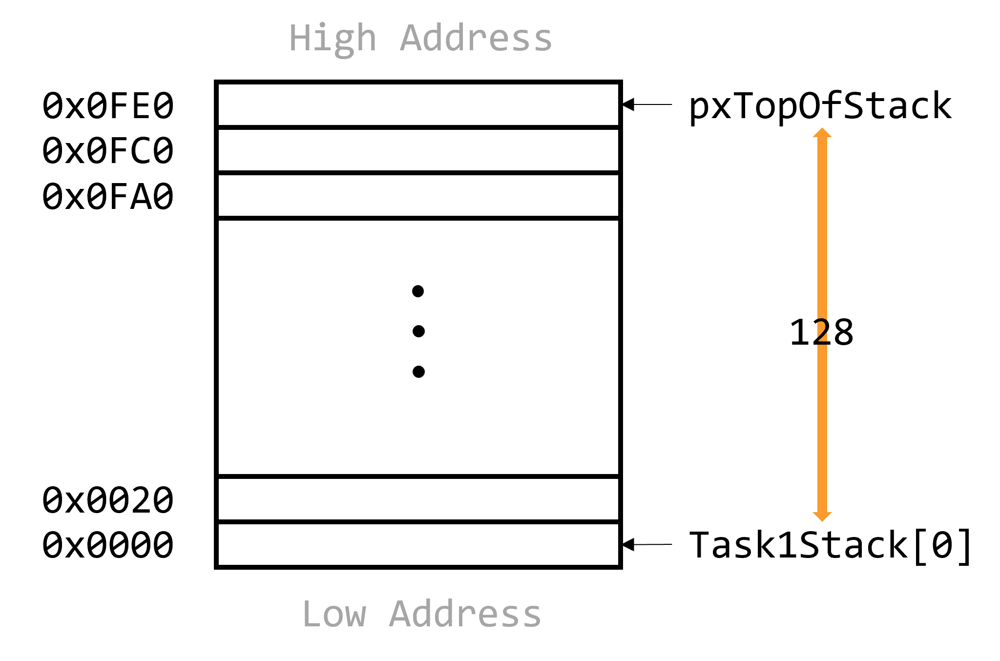
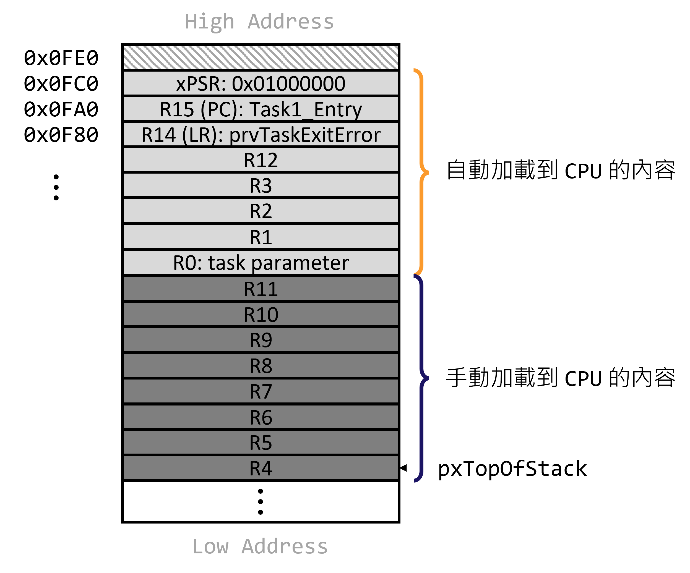
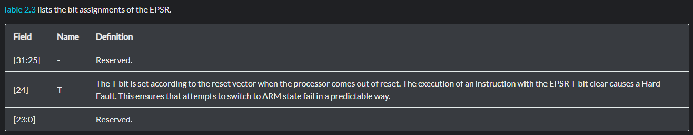

<!-- Copyright 2022 KaiWei TSOU. All Rights Reserved.
    This personal note refers to <<FreeRTOS 內核實現與應用開發實戰指南>> by "野火".
-->

# 7.1 本章目標

我們將會在這個章節創建兩個任務，並且讓這兩個任務不斷切換。注意此處的切換並不是單純使用輪詢系統，以序列式的方式做任務切換，而是利用系統調度，達成 CPU 同時在做兩個任務的效果。

**Note:** 早期電腦只能一次處理一個任務，後續 OS 加入之後，OS 可以幫助調度不同任務的處理，幫助 CPU 可以在多個任務中隨時切換，達成 CPU 在同時處理多個任務的效果，這種能力稱為 **multitasking**。

# 7.2 甚麼是任務

在裸機系統中，主體是在 ```main``` 函式內無限循環，按照既定順序完成各個事情。在多任務系統中，任務代表的是各個獨立且無法返回的函式。

```c
void task_entry(void *parg)
{
    /*Infinite loop and cannot return*/
    for (;;) {
        /*Task's job*/
    }
}
```

# 7.3 創建任務

## 7.3.1 定義任務 Stack

在裸機系統中，局部變量、函式返回地址等環境變數皆放在 stack 的地方，stack 的大小一般放在啟動文件，最後由 C 函式 ```_main``` 進行初始化。但是對於多任務系統，每個任務皆是獨立的，因此每個任務皆會分配到獨立的 stack，這些 stacks 空間通常是一個預先定義好的全域 array，或是動態配置的 heap 空間。

本章節的終極目標在於使兩個任務以一定頻率切換，因此我們需要定義兩個任務 stack。```StackType_t``` 是一個 4 Bytes 的型別，因此任務 stack 是以 word 為單位，我們在以下程式碼定義的任務 stack 大小為 128 words (128W)，即 512B。

```c
#define TASK1_STACK_SIZE    128
StackType_t Task1Stack[TASK1_STACK_SIZE];

#define TASK2_STACK_SIZE    128
StackType_t Task2Stack[TASK2_STACK_SIZE];
```


## 7.3.2 定義任務函式

我們在 ```main.c``` 定義的任務函式如下。

```c
uint8_t flag1;
uing8_t flag2;

void delay(uint32_t count)
{
    for (; count != 0; --count);
}

void Task1_Entry(void *p_arg)
{
    for (;;)
    {
        flag1 = 1;
        delay(100);
        flag1 = 0;
        delay(100);
    }
}

void Task2_Entry(void *p_arg)
{
    for (;;)
    {
        flag2 = 1;
        delay(100);
        flag2 = 0;
        delay(100);
    }
}
```

## 7.3.3 定義任務控制塊 Task Control Block (TCB)

系統為了調度任務，為每個任務添加了一個 TCB，TCB 將當於任務的身分證，裡面紀錄任務的執行期間 stack pointer 的位置 (pxTopOfStack)、任務的 linked list、任務起始位置 (pxStack，紀錄任務 stack 的 base address)、任務名稱 (pcTaskName)、任務優先度 (uxPriority)等。

```c
typedef struct tskTaskControlBlock
{
    volatile StackType_t * pxTopOfStack;

    ListItem_t xStateListItem;
    ListItem_t xEventListItem;
    UBaseType_t uxPriority;
    StackType_t * pxStack;
    char pcTaskName[ configMAX_TASK_NAME_LEN ];
} tskTCB;

typedef taskTCB TCB_t
```

我們需要在 ```main.c``` 文件中分別定義兩個 TCB，對應到我們的兩個任務。

```c
TCB_t Task1TCB;
TCB_t Task2TCB;
```


```TCB_t``` struct   | 用途
:--------------------|:--------------------------------------------------
```pxTopOfStack```   | 紀錄目前 stack pointer 的位置
```xStateListItem``` | 任務的 linked list 掛勾，透過這個掛勾掛起多個任務
```uxPriority```     | 任務的優先度
```pxStack```        | 任務 stack 的 base address
```pcTaskName```     | 任務名稱


## 7.3.4 實現任務創建函式


在開始閱讀程式碼之前，我們先認識會遇到的型別：

型別                 | 定義
:--------------------|:--------------------------------------------------
```TaskFunction_t``` | 函式指標，指向 return void 且只有一個 void * 參數的函式
```TaskHandle_t```   | 空指針 void *


### 1. xTaskCreateStatic

任務 stack、任務函式主體、任務控制塊 TCB 必須要聯繫起來，才能由系統統一調度。聯繫的工作由 ```xTaskCreateStatic()``` 來實現。該呼叫函式需要傳入幾個參數：

1. ```pxTaskCode```：代表兩個切換函式的函示指標。
2. ```pcName```：代表任務名稱。
3. ```ulStackDepth```：代表任務 stack 的大小，先前我們宣告出長度為 ```128``` 的 32-bit 陣列。
4. ```pvParameters```：任務函式的參數，但是目前兩個切換函式並沒有任何輸入參數。
5. ```uxPriority```：任務優先級。
6. ```puxStackBuffer```：先前定義的 ```Task1Stack[128]```、```Task2Stack[128]```。
7. ```pxTaskBuffer```：外部定義的 TCB 物件 ```Task1TCB```。


```c
#if ( configSUPPORT_STATIC_ALLOCATION == 1 )

TaskHandle_t xTaskCreateStatic( TaskFunction_t pxTaskCode,
                                const char * const pcName,
                                const uint32_t ulStackDepth,
                                void * const pvParameters,
                                UBaseType_t uxPriority,
                                StackType_t * const puxStackBuffer,
                                StaticTask_t * const pxTaskBuffer )
{
    TCB_t * pxNewTCB;
    TaskHandle_t xReturn;

    configASSERT( puxStackBuffer != NULL );
    configASSERT( pxTaskBuffer != NULL );

    if( ( pxTaskBuffer != NULL ) && ( puxStackBuffer != NULL ) )
    {
        pxNewTCB = ( TCB_t * ) pxTaskBuffer;
        pxNewTCB->pxStack = ( StackType_t * ) puxStackBuffer;
        prvInitialiseNewTask( pxTaskCode, pcName, ulStackDepth, pvParameters, uxPriority, &xReturn, pxNewTCB, NULL );
        prvAddNewTaskToReadyList( pxNewTCB );
    }
    else
    {
        xReturn = NULL;
    }

    return xReturn;
}

#endif
```

任務控制塊 TCB 以及任務 stack 是可以利用動態創建的 (```tskSTATIC_AND_DYNAMIC_ALLOCATION_POSSIBLE``` 設定)，任務結束時，記憶體會釋放。但是我們本章的例子將利用靜態創建：```configSUPPORT_STATIC_ALLOCATION``` 設置為 ```1```，任務結束後，記憶體不會釋放。

我們將 ```pxTaskBuffer``` 傳入函式，並由一個 ```TCB_t``` 指標指向它。而 ```puxStackBuffer``` 則是代表任務 stack 的 base address，並且以此更新 TCB 下的 ```pxStack``` 指標。最後我們會透過 ```prvInitialiseNewTask``` 函式將這些訊息聯繫起來，並且讓 ```xReturn``` 這個空指針指向 ```TCB_t``` 指向的內容。


### 2. prvInitialiseNewTask

這個函式主要的內容為：

1. 尋找 top of stack，top of stack 會對應到低位址，bottom of stack 對應到低位址。
2. 更新函式名稱。
3. 初始化 ```TCB_t``` 物件的 linked list。
4. 初始化任務 stack：將任務函式、任務參數等資訊放入 stack。
5. 更新 ```xReturn``` 指標，```pxCreatedTask``` 的型別為 ```TaskHandle_t *``` (```void **```)，即為空指標的指標，```pxCreatedTask``` 指向 ```xReturn``` 指標。


```c
static void prvInitialiseNewTask( TaskFunction_t pxTaskCode,
                                  const char * const pcName,
                                  const uint32_t ulStackDepth,
                                  void * const pvParameters,
                                  UBaseType_t uxPriority,
                                  TaskHandle_t * const pxCreatedTask,
                                  TCB_t * pxNewTCB,
                                  const MemoryRegion_t * const xRegions )
{
    StackType_t * pxTopOfStack;
    UBaseType_t x;

    /* Calculate the top of stack address.  This depends on whether the stack
     * grows from high memory to low (as per the 80x86) or vice versa.
     * portSTACK_GROWTH is used to make the result positive or negative as required
     * by the port. */
    pxTopOfStack = pxNewTCB->pxStack + (ulStackDepth - (uint32_t) 1);
    pxTopOfStack = (StackType_t *) ( ((uint32_t) pxTopOfStack) & (~((uint32_t) 0x0007)) )

    /* Store the task name in the TCB. */
    if( pcName != NULL )
    {
        for( x = ( UBaseType_t ) 0; x < ( UBaseType_t ) configMAX_TASK_NAME_LEN; x++ )
        {
            pxNewTCB->pcTaskName[ x ] = pcName[ x ];

            /* Don't copy all configMAX_TASK_NAME_LEN if the string is shorter than
             * configMAX_TASK_NAME_LEN characters just in case the memory after the
             * string is not accessible (extremely unlikely). */
            if( pcName[ x ] == ( char ) 0x00 )
            {
                break;
            }
            else
            {
                mtCOVERAGE_TEST_MARKER();
            }
        }

        /* Ensure the name string is terminated in the case that the string length
         * was greater or equal to configMAX_TASK_NAME_LEN. */
        pxNewTCB->pcTaskName[ configMAX_TASK_NAME_LEN - 1 ] = '\0';
    }
    else
    {
        /* The task has not been given a name, so just ensure there is a NULL
         * terminator when it is read out. */
        pxNewTCB->pcTaskName[ 0 ] = 0x00;
    }

    /* This is used as an array index so must ensure it's not too large. */
    configASSERT( uxPriority < configMAX_PRIORITIES );

    if( uxPriority >= ( UBaseType_t ) configMAX_PRIORITIES )
    {
        uxPriority = ( UBaseType_t ) configMAX_PRIORITIES - ( UBaseType_t ) 1U;
    }
    else
    {
        mtCOVERAGE_TEST_MARKER();
    }

    pxNewTCB->uxPriority = uxPriority;
    

    vListInitialiseItem( &( pxNewTCB->xStateListItem ) );

    /* Set the pxNewTCB as a link back from the ListItem_t.  This is so we can get
     * back to  the containing TCB from a generic item in a list. */
    listSET_LIST_ITEM_OWNER( &( pxNewTCB->xStateListItem ), pxNewTCB );

    pxNewTCB->pxTopOfStack = pxPortInitialiseStack( pxTopOfStack, pxTaskCode, pvParameters );

    if( pxCreatedTask != NULL )
    {
        /* Pass the handle out in an anonymous way.  The handle can be used to
         * change the created task's priority, delete the created task, etc.*/
        *pxCreatedTask = ( TaskHandle_t ) pxNewTCB;
    }
    else
    {
        mtCOVERAGE_TEST_MARKER();
    }
}
```

我們針對 ```pxTopOfStack = (StackType_t *) ( ((uint32_t) pxTopOfStack) & (~((uint32_t) 0x0007)) )``` 來討論，這行程式碼代表的是 ```pxTopOfStack``` 是以 4B 來對齊。舉例來說，若原本 ```pxTopOfStack = 35 = 0b00100011```，那經過上述運算，```pxTopOfStack``` 將會變為 ```32```。

```
0b00100011 & (~ 0b00000111) = 0b00100011 & 0b11111000 = 0b00100000 = 32
```

舉例來說，假設 ```Task1Stack``` 的起始位置在 ```0x0000```，那 ```pxTopOfStack``` 在做 4B 對齊之前位置會在 ```0x0FE0```，因為  ```pxTopOfStack``` 是一個 32b 的指標。而 ```0x0FE0``` 剛好是 4B 對齊的位置，所以最後 ```pxTopOfStack``` 就在 ```0x0FE0``` 的地方。


<p align=center>
    
</p>


### 3. pxPortInitialiseStack

```c
#define portINITIAL_XPSR    ( 0x01000000 )

static void prvTaskExitError( void )
{
    volatile uint32_t ulDummy = 0UL;
    while( ulDummy == 0 ) {}
}


StackType_t * pxPortInitialiseStack( StackType_t * pxTopOfStack,
                                        StackType_t * pxEndOfStack,
                                        TaskFunction_t pxCode,
                                        void * pvParameters )
{
    pxTopOfStack--;
    *pxTopOfStack = portINITIAL_XPSR;
    pxTopOfStack--;
    *pxTopOfStack = ( StackType_t ) pxCode;
    pxTopOfStack--;
    *pxTopOfStack = ( StackType_t ) portTASK_RETURN_ADDRESS;
    pxTopOfStack -= 5;
    *pxTopOfStack = ( StackType_t ) pvParameters;
    pxTopOfStack -= 9;
    
    return pxTopOfStack;
}
```

當異常發生時，CPU 會自動從 stack 加載到 CPU register 的內容有 8 個：R0、R1、R2、R3、R12、R14、R15 和 xPSR 的第 24 bit。而其他 R4 - R11 的暫存器內容必須要手動加載。在 ```pxPortInitialiseStack``` 函式中，我們必須設定幾個 stack 的值，這些 stack 值會對應到 CPU register：

1. xPSR 的第 24 bit 須為 1 (目前原因未知)。
2. R15 (Program counter, PC)：任務入口需要設為我們的 ```Task1_Entry``` 或是 ```Task2_Entry```。
3. R14 (Link register, LR)：需要存放返回函式的地址，通常任務是不會返回的，因此返回函式的內容，為一個無限迴圈。
4. R0 (One of general purpose registers)：放置我們 ```Task1_Entry``` 的輸入參數。

其他的 stack 內容會被初始化為 ```0```。此時，我們的 ```pxTopOfStack```，以及任務 stack 的具體內容如下：

<p align=center>
    
</p>

當第一次任務運行時，OS 會拋出一個異常並且開始處理任務 stack 的內容。首先會從 ```pxTopOfStack``` 開始手動加載 stack 內容到 CPU R4 - R11，之後退出異常時，任務 stack 任下的 8 words 的內容會自動加載到其他 CPU registers，此時 CPU 的 PC 指針就會指向我們要執行的 ```Task1_Entry``` 或是 ```Task2_Entry```。因為這兩個函式的內容是一個無限迴圈，所以正常情況下，是不會 return 的，也就是不會返回到先前定義的 ```prvTaskExitError``` 函式。


**Note:** 目前尚未完全了解 ARM 架構，以及各個 register 的功用。這裡列出 xPSR 查到的資料，未來若完全融會貫通再補充。xPSR 是一個狀態暫存器，負責儲存目前 program 的狀態，由三個register組成：

- Application Program Status register (APSR)
- Interrupt Program Status register (IPSR)
- Execution Program Status register (EPSR)

其中 EPSR[24] 對應到的[說明](https://developer.arm.com/documentation/ddi0413/c/ch02s02s02)為：

<p align=center>
    
</p>


# 7.4 實現 Ready Task List

Ready task list 紀錄將要執行的所有 task，並且不同的 ready task list 支援不同的優先級。目前**猜測** FreeRTOS 會在某處將 ready task list 裡的 node 拿出來，作為下一個將要執行的 task (注意 linked list 的 node 只是一個掛勾，即 ```TCB.xStateListItem```)。本章節的例子並沒有支援優先級的功能，因此 task 的選用可以藉由單純的 TCB 互相置換來實現，猜測在後續章節中，出現需要考慮優先級的例子時，ready task list 才會真正介紹。


## 7.4.1 定義 Ready Task List

```c
#define configMAX_PRIORITIES 5

List_t pxReadyTasksLists[ configMAX_PRIORITIES ];
```

任務創建好後，我們需要把任務添加到列表裡面，表示任務已經就緒，OS 隨時可以調度。Ready task list 定義於 ```task.c``` 文件。其中該列表的大小由 ```configMAX_PRIORITIES``` 這個 preprocessor 定義，目前我們默認為 ```5```，代表 ```pxReadyTasksLists``` 支援 5 種優先級，每種優先級都是一個 linked list。

## 7.4.2 初始化 Ready Task List

```c
static void prvInitialiseTaskLists( void )
{
    UBaseType_t uxPriority;

    for( uxPriority = ( UBaseType_t ) 0U; uxPriority < ( UBaseType_t ) configMAX_PRIORITIES; uxPriority++ )
    {
        vListInitialise( &( pxReadyTasksLists[ uxPriority ] ) );
    }
}
```

## 7.4.3 將任務插入 Ready Task List

```c
prvInitialiseTaskLists();

Task1_Handle = xTaskCreateStatic( (TaskFunction_t)Task1_Entry,
                                  (char *)"Task1",
                                  (uint32_t)TASK1_STACK_SIZE,
                                  (void *)NULL,
                                  (StackType_t *)Task1Stack,
                                  (TCB_t *)&Task1TCB);
vListInsertEnd( &(pxReadyTasksLists[1]), &( ((TCB_t *)(&Task1TCB))->xStateListItem ));

Task2_Handle = xTaskCreateStatic( (TaskFunction_t)Task2_Entry,
                                  (char *)"Task2",
                                  (uint32_t)TASK2_STACK_SIZE,
                                  (void *)NULL,
                                  (StackType_t *)Task2Stack,
                                  (TCB_t *)&Task2TCB);
vListInsertEnd( &(pxReadyTasksLists[2]), &( ((TCB_t *)(&Task2TCB))->xStateListItem ));
```

# 7.5 實現 Scheduler

Scheduler 的工作是排程、調動各個 tasks，以此實現任務切換。為了達成 scheduler 的功能我們需要：**全域變數**以及**任務切換函式**。

整體流程如下：

1. 啟動 task scheduler。
2. 啟動 first task，利用 SVC 中斷，將任務 stack 的參數放入 CPU register。
3. 利用 PendSV 中斷，進行任務切換，並在 ```SVHandler``` 進行 context switch。

## 7.5.1 啟動 Scheduler

### 1. vTaskStartScheduler

```pxCurrentTCB``` 是一個全域指針，指向目前執行任務的 TCB。```vTaskStartScheduler``` 的工作在於根據優先級，從 pxReadyTasksLists 更新 ```pxCurrentTCB``` 指針，但是目前並沒有深入到優先級的功能，因此 ```vTaskStartScheduler``` 的 function body 將以簡易的版本呈現如下。

```c
void vTaskStartScheduler ( void )
{
    pxCurrentTCB = &Task1TCB;

    if (xPortStartScheduler() != pdFALSE)
    {
        // Starting scheduler successfully.
        // Will never come back
    }
}
```

需要注意的是，當 scheduler 開始作動後，將會持續運作，不會在回到 ```vTaskStartScheduler``` 這支函式。


### 2. xPortStartScheduler

**ARM 架構下各個中斷的整理**

Exception Type          | Explanation
:-----------------------|:-----------------------------------------------------------------------
Reset                   | 按下 reset 後會從向量表中指定的位址，用 privileged thread mode開始執行
NMI                     | 簡單說就是除了 reset 外最強的 exception
Hard Fault              | 做 exception handler 發生不可預期的悲劇時會觸發這個例外
Memory Management Fault | memory protection 失敗時，這個例外是 MPU 觸發的，用來禁止裝置進入絕對不可進入的記憶體區域
Bus Fault               | 執行指令或是 data transaction 時發生記憶體相關的錯誤，可能是 bus 的問題
Usage fault             | 執行未定義的指令、不合法的未對齊存取、指令執行時出現無效的狀態、exception return 時出錯、除以 0 (需要自行設定)
SVCall                  | SVC instruction 執行的 supervisor call（在OS的環境下）
PendSV                  | 在 OS 的環境下，通常是用於 context switch
SysTick                 | 當 timer 倒數到 0 時觸發，也可以用軟體中斷，OS 會把這個 exception 當成 system tick。
Interrupt(IRQ)          | 週邊裝置觸發的 exception，或是軟體產生的 request


Exception number | IRQ number  | Exception type  | Priority         | Vector address       | Activation
:----------------|:------------|:----------------|:-----------------|:---------------------|:----------
1                | -           | Reset           | -3, the highest  | 0x00000004           | Asynchronous
2                | -14         | NMI             | -2               | 0x00000008           | Asynchronous
3                | -13         | HardFault       | -1               | 0x0000000C           | Synchronous
4-10             | -           | -               | Reserved         | -                    | -
11               | -5          | SVCall          | Configurable     | 0x0000002C           | Synchronous
12-13            | -           | Reserved        | -                | -                    | -
14               | -2          | PendSV          | Configurable     | 0x00000038           | Asynchronous
15               | -1          | SysTick         | Configurable     | 0x0000003C           | Asynchronous
15               | -           | Reserved        | -                | -                    | -
16 and above     | 0 and above | IRQ             | Configurable     | 0x00000040 and above | Asynchronous


SysTick 是 ARM 的心臟，間隔每一小段時間會中斷一次，並且更新 timer，試想若我們如果只利用 SysTick 實現任務接換會發生甚麼狀況？假設 SysTick 每隔 1 ms 會中斷一次，而有個 IO 觸發 IRQ 中斷，需要 5 ms 的時間處理。

若我們將 SysTick 調整為最高優先級：

- **time = 1ms:** 處理 IO 的函式執行到一半，SysTick 中斷，並且做任務切換。
- **time > 1ms:** 中斷返回後，原本處理 IO 的函式被切換，導致無法正確處理 IO。

若我們將 SysTick 調整為最低優先級：

- **time = 0ms:** 收到 IO 中斷，開始處理 IO 的函式。
- **time = 1ms:** 收到 SysTick 中斷，但是優先級低，無法及時處理 SysTick。
- **time = 5ms:** 結束 IO 處理，開始處理 SysTick 中斷，並把 timer 調成錯誤的 1 ms (實際為 5 ms)。

從上述兩個例子我們可以發現，無論是 SysTick 怎麼調整優先級一定會發生錯誤，因此我們將任務切換得功能擺到 PendSV 中斷，並且將 SysTick 的優先級設為最高，防止 timer 出錯，PendSV 的優先級調為最低，避免搶佔其他中斷的執行。

- **time = 0ms:** 收到 IO 中斷，開始處理 IO 的函式。
- **time = 1ms:** 收到 SysTick 中斷，開啟 PendSV 中斷，並更新 timer。
- **time > 1ms:** 不會被 PendSV 搶佔，而是回到 IO 中斷，繼續處理 IO。
- **time = 2ms:** 收到 SysTick 中斷，開啟 PendSV 中斷，並更新 timer。
- **time > 2ms:** 不會被 PendSV 搶佔，而是回到 IO 中斷，繼續處理 IO。
- **time = 3ms:** 收到 SysTick 中斷，開啟 PendSV 中斷，並更新 timer。
- **time > 3ms:** 不會被 PendSV 搶佔，而是回到 IO 中斷，繼續處理 IO。
- **time = 4ms:** 收到 SysTick 中斷，開啟 PendSV 中斷，並更新 timer。
- **time > 4ms:** 不會被 PendSV 搶佔，而是回到 IO 中斷，繼續處理 IO。
- **time = 5ms:** 收到 SysTick 中斷，開啟 PendSV 中斷，並更新 timer。
- **time > 5ms:** 結束 IO 處理，開始處理 PendSV 中斷，任務切換成功。


以下是 ```xPortStartScheduler``` 的簡化版，和我們非相關的設定是並沒有呈現。FreeRTOS 將 PendSV 以及 SysTick 調整到最低，並開始我們的第一個任務。將 SysTick 的優先度調整為最低的用意在於，我們可以讓系統達到 real-time 的效能，timer 的計時可能會因此出現錯誤，但是這並不會影響多大。就像人類的心臟一樣，有時候一分鐘跳 70 下、有時候一分鐘跳 90 下，雖然頻率不固定，但是最終都會達到任務切換的目的，以此換取 IO 處理的效能。

```c
BaseType_t xPortStartScheduler( void )
{
    /* Make PendSV and SysTick the lowest priority interrupts. */
    portNVIC_SHPR3_REG |= portNVIC_PENDSV_PRI;
    portNVIC_SHPR3_REG |= portNVIC_SYSTICK_PRI;

    vPortStartFirstTask();

    /* Not supposed to run to here. */
    return 0;
}
```


### 3. prvStartFirstTask

```prvStartFirstTask``` 的工作在於，更新 main stack pointer (MSP)，並且產生 SVC 中斷。首先，```0xE000ED08``` 這個位址儲存了 SCB_VTOR 這個 register 的地址，我們起始階段需要將 MSP 的值更新成 SCB_VTOR。

接著中斷(exception)、異常(Fault)會被全部允許，並且開啟一個 SVC 的中斷服務。

```c
__asm void prvStartFirstTask( void )
{
/* *INDENT-OFF* */
    PRESERVE8

    /* Use the NVIC offset register to locate the stack. */
    ldr r0, =0xE000ED08
    ldr r0, [ r0 ]
    ldr r0, [ r0 ]

    /* Set the msp back to the start of the stack. */
    msr msp, r0
    /* Globally enable interrupts. */
    cpsie i
    cpsie f
    dsb
    isb
    /* Call SVC to start the first task. */
    svc 0
    nop
    nop
/* *INDENT-ON* */
}
```

**Note:**

- ```ldr r0, =0xE000ED08```：將 0xE000ED08 加載到 r0。
- ```ldr r0, [ r0 ]```：將 r0 指向位址的值加載到 r0。
- ```msr msp r0```：加載特殊功能 register (r0) 的值到 msp。
- ```svc 0 ```：啟動 SVC 中斷。

**Note:**

CPS command | Mask        | Description
:-----------|:-----------:|:-----------
CPSID I     | PRIMASK=1   | 關中斷
CPSIE I     | PRIMASK=0   | 開中斷
CPSID F     | FAULTMASK=1 | 關異常
CPSIE F     | FAULTMASK=0 | 開異常

**Note:**

Cortext-M Core Register Nmae | Description
:----------------------------|:-------------------------------------------------------------------------------
PRIMASK                      | 為 1 時所有的中斷無法開啟，只剩下 NMI 和 HardFault 可以響應。 為 0 代表允許所有中斷。
FAULTMASK                    | 為 1 時只有 NMI 可以響應，所有其他中斷、HardFault 皆無法響應。為 0 代表允許所有中斷。
BASEPRI                      | 為 0 時代表不關閉任何中斷，為 x 時代表優先級大於等於 x 的中斷將會被忽略。