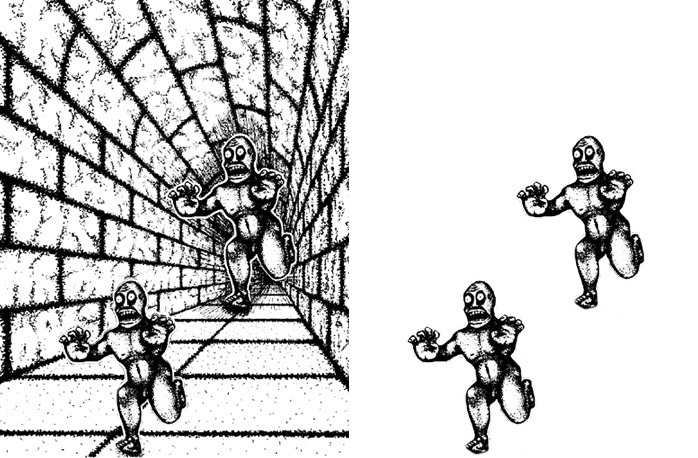

# 快思慢想

## Chapter 1

## Chapter 2

## Chapter 3

## Chapter 4

## Chapter 5

## Chapter 6

## Chapter 7 驟下結論的機制

```Ann approached the bank.```

若你看到這句話第一時間聯想到甚麼？Ann 是一個滿腦子是錢的女人準備去銀行辦事情，對吧？但其實也有可能是另一個解釋，Ann 準備前往河岸！系統一會根據目前得到的片面資訊，快速、輕易的做出結論，卻忽略了其他的選項，而提出懷疑並非系統一擅長的事情，而是系統二的專長，可惜系統二天性懶惰，所以我們做出的結論很容易受到系統一的影響！

### 信念的偏見和確定信念

為了支持懷疑是系統二的操作，這裡有一項實驗，我們提供受試者數個句子，其中有的是合理的，有的是不合理的，如：一個杯子是水。並且要求受試者同時記住一些數字，結果發現受試者將很多錯誤的句子判斷成合理的句子！代表當系統二忙於記住數字時，無暇對眼前的句子做出懷疑，放任系統一輕易得出結論。

### 月暈效應

當你很喜歡某個人時，你也可能會喜歡他的聲音、穿著，反之亦然。因為系統一喜歡用簡單、**一致性**的方式看待世界。如果你新認識了一個朋友並且覺得他好相處且隨和，下次有人問誰可以做些慈善公益活動時，這位新認識的朋友會直接浮現在腦海中，因為你已經對他產生好感，卻忽略了隨和這個屬性不一定代表他是慷慨願意付出的人！

```小明：聰明、認真、向上、固執、愛批評、忌妒```

```小美：忌妒、愛批評、固執、聰明、認真、向上```

若選一個人當朋友你會選誰？多數人會選擇小明，因為前幾項性格會影響後面性格的含意，一個聰明、認真，卻固執的人可能被解釋為擇善固執，但是一個愛批評又固執的人可能被解釋為堅持己見，難以溝通。

再舉一個例子，改考卷時，改到第一題答得很好的學生，會傾向認為他是個聰明的學生，即使第二題達不好，還是會給他偏高的分數。若第一題答非所問，那後面的題目縱使答的再好，也有可能被評較低的分數。為了解決月暈效應，可以利用**去除相關錯誤**的方式，比如，先改好全班同學的第一題，再開始改全班的第二題。

### What You See Is All There Is (WYSIATI)

系統一會輕率的下結論，並且自以為此結論有連貫性。「小英會是一個好總統嗎？她既聰明又堅強...」。看到這裡我們可能馬上認為小英是一個好總統，但是我們的系統一太快下決定了，萬一後面是「但是她既心機又反覆不定，不兌現承諾」呢？

尋求合理一致性的系統一，加上懶惰的系統二，導致我們在證據不足的情況下，倉促的做決定：

* 太過自信
* 框架效應：「存活率 90%」比「死亡率 10%」更有說服力
* 忽略機率：小明個性安靜、內向，喜歡與電腦為伍，請問他的職業屬於工業還是服務業？若你腦海中浮現的是工業，代表你忽略了一個統計事實，台灣服務業從業人口是工業的 1.6 倍！


## Chapter 8 我們如何做出判斷

### 基本評估

系統一持續在監控大腦內外發生的事情，沒有特別意圖，只是不斷評估各個層面。這些基本評估容易被拿來取代困難的問題，即為**捷徑**和**偏見**。

演化習慣上，系統一隨時在運作，評估周遭的環境危險與否。舉例來說，人類利用臉型等資訊就能判斷對方是否強勢，以及值不值得信任，縱使準確率不是完全準確，但這項能力卻助於生存。某項實驗中，給受試者看 0.1 秒各種人臉，並要求受試者判斷其能力、是否值得信任，發現被評為有能力的人，其中 70% 是當選的政治人物！顯示系統一自動化形成某種偏見，最後系統二根據這個偏見做最後決定。這項實驗也說明了哪一種選民最容易受系統一影響 (用面相決定選票)？大量看電視，時常看到候選人的選民！

雖然系統一隨時做出某些基本的評估，但是同時也會忽略某些資訊，尤其系統一會時常忽略總和之類的資訊。實驗中，先給受試者看到因為全身羽毛被原油汙染，而溺水的水鳥的照片，接著讓受試者分三組，並且判斷解救 2 千、2 萬、20 萬隻水鳥所需的金額，發現受試者判斷的金額相差無幾，代表他們只受到照片影響，完全忽略了總和數量的條件。

### 強度的配對

系統一可以讓我們對不同面向的"強度"做比對，以顏色來說，大屠殺可能會對應到鮮紅色，以聲音來說，大屠殺可能對應到很大、不和諧的聲響。舉個例子，假設小明 4 歲就能閱讀，小美的身高跟小明的早熟程度一樣，他有多高？小美的薪水跟小明的早熟程度一樣，那小美的薪水區間？不用經過嚴謹的統計計算，我們依然可以輕易的給出某個答案，就是因為系統一會快速地將小明的閱讀能力強度，轉換為其他面向的強度！

### 心智的發散性

系統一會持續評估各種事情，即使這些事情並不是我們需要的。在實驗中，請受試者快速判斷聽到的兩個字是否押韻：Vote - Note 、Vote - Goat...。唸到 Vote - Note 的時候，可以快速判斷，但是 Vote - Goat 這題受試者會些微停頓再回答，因為受試者會聯想到字尾不同，這個與聲音無關的訊息妨礙了受試者的判斷。

## Chapter 9 回答一個比較容易的問題

### 取代問題

日常心智活動時，我們很少會回答不出問題，原因在於系統一會找一個容易一點的問題來代替困難的，然後將這個簡單問題的答案作為答案。舉例來說：

```這一個月以來，你有多快樂？```

```你願意捐多少錢拯救北極熊？```


這些問題其實涉及到複雜的心智活動，自己一個月以來有多快樂需要，需要回想這個月每天的日常，才能精準的回答。但在我們不自覺的情況下，我們很容易將這些問題轉化為以下問題來思考：

```現在我有多快樂？```

```當我想到北極熊的時候，我的情感有多強烈？```

心智的發散性使我們對這些困難的問題有立即的解答。其中可以注意到的是，第二個問題涉及到金錢的量化，此時系統一的強度配對又可以發揮作用了。(Chapter 7)

### 3D 的捷徑

請看下面左圖的兩個人，請問哪一個人比較大？

<p>
    
</p>

相信大部分的人會直覺性地回答右上角的人比較大，但是當我們將背景擦掉之後，會發現這兩個人其實一樣大！這個測驗就是一個經典的 3D 捷徑。其中的邏輯在於，我們的問題只問：哪一個人比較大，並沒有要求受試者將圖片以 3D 的方式判讀，但是因為受到圖片的暗示，受試者會自然地將圖片轉為 3D 的角度，以此作為判斷依據，而非單純 2D 的角度作回答。

或許會有人質疑這就只是單純的視覺錯覺，但是我認為作者的脈絡在於，這個題目的解答其實有兩種可能，但是受試者全部都受到暗示的影響，只回答其中某一個答案，很明顯系統一的思考採取了容易回答的捷徑，將這張圖片作為 3D 空間來看待，因為這樣比較直覺，完全忽略了有其他可能。從這個角度思考，就可以理解作者在這個測試中，想要表達的思考捷徑。

### 快樂心情的捷徑

這裡作者提出了另一個測驗，以解釋取代問題以及思考捷徑的現象。作者分了兩組受試組，其中一組的問題為：

```這幾天你有多快樂？```

```你上個月約會幾次？```

而另一組受試組的問題為：

```你上個月約會幾次？```

```這幾天你有多快樂？```

測試的結果發現，第一組快不快樂和上個月約會幾次沒有任何相關性，但是第二組快不快樂和上個月約會幾次呈現正相關，原因在於你快不快樂這個問題難以回答，但是當我們先遇到 ```你上個月約會幾次``` 的這個問題，再遇到快不快樂這個問題的時候，受試者會受到約會的次數而影響快不快樂的回答，約會越多次會暗示受試者上個月開心的時光非常多，反之亦然。從這個例子可以很明顯看出，受試者以約會幾次作為快不快樂的替代捷徑。

### 情意的捷徑

情緒的影響非常大，甚至會影響到我們的理性判斷，舉例來說，如果你偏好某個政黨，那你即有可能概括接受該政黨的所有政策。如果你不喜歡某個人，那他做的任何事情你都可能有別的解讀。這裡我們發現系統二的另一個特性，除了作為監控者之外，**在態度方面系統二更像一位支持者**，單方面地接受尋求一致性的系統一的意見。

```情意捷徑：人們讓自己的好惡決定他們的世界觀。```
